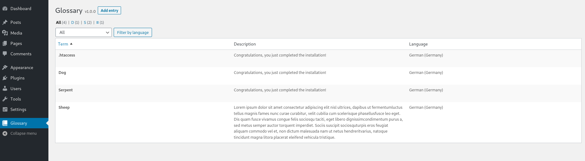
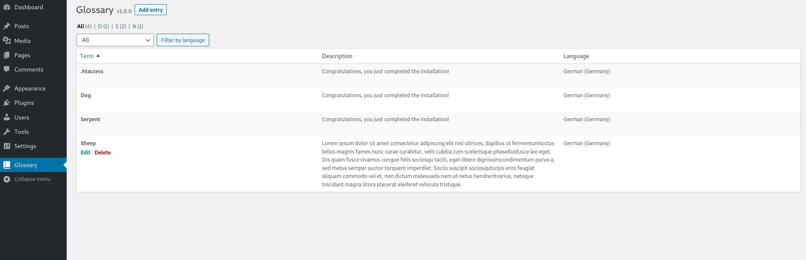
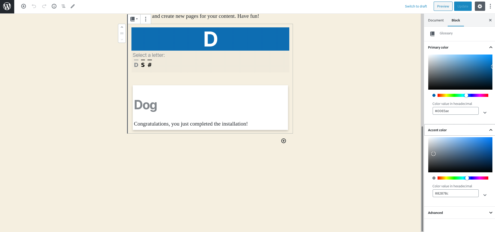
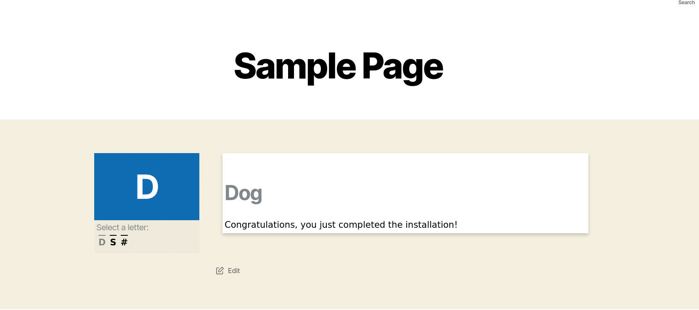

# Glossary by Arteeo

Glossary block for the Gutenberg editor.

## Users

### Overview 

This plugin provides a multilanguage glossary-block for the WordPress-Gutenberg-Editor. It also includes a backend to add, update and remove entries from within the glossary.

### Install

To install the plugin simply download it from the [WordPress repository](https://wordpress.org/plugins/search/glossary-by-arteeo/). After activation within your WordPress instance the plugin is ready to go.

### Features

- The plugin actively supports multi-language sites and offers the following languages in both the frontend and the backend:
    - English
    - French
    - German
    - Italian
- The backend has filtering options to filter by letter and language. 
- The colors of the frontend are completely adjustable.
- The frontend adjusts itself to fit the container size (responsive / mobile friendly).

### Screenshots

#### Backend Overview

#### Block inside Gutenberg

#### Block frontend

## Developers

### Contributing

We really appreciate the time and effort many developers invest into open source. We welcome anyone interested in contributing to this repository. However, when contributing to this repository, please first discuss the change you wish to make via issue, email, or any other method with the owners of this repository before making a change.

### Dependencies

The following software has to be installed in order for you to be able to adjust and build this plugin (newer versions should also work):

1. [npm v14.x](https://github.com/nodesource/distributions)
2. [php 7.4](https://www.php.net/)
3. [phpcs](https://github.com/squizlabs/PHP_CodeSniffer)
4. [composer](https://getcomposer.org/)
5. [vscode](https://code.visualstudio.com/) (optional)

### Setup

1. Install npm dependencies `npm i`
2. Install composer dependencies `composer install`
3. Configure `phpcs` for use with WordPress guidelines `phpcs --config-set installed_paths <path to repository>/vendor/wp-coding-standards/wpcs`
4. Run `phpcs -i` which should return amongst other things `WordPress, WordPress-Extra, WordPress-Docs and WordPress-Core`
5. Install the phpcs extension for vscode (optional)
6. Install the eslint extension for vscode (optional)

### Scripts

#### 📜📜  `npm run build:dev`

- Use to compile and the block in development mode.
- Compiles the plugin into the `dist` folder.
- Creates `glossary-by-arteeo.zip` which can be uploaded to a WordPress instance.

#### 📜📜 `npm run build:prod`

- Use to build the plugin in production mode
- Compiles the plugin into the `dist` folder.
- Creates `glossary-by-arteeo.zip` which can be uploaded to a WordPress instance.

#### 📜📜 `npm run lint:css`

- Checks if the css/scss files are in accordance with the WordPress guidelines.

#### 📜📜 `npm run lint:js`

- Checks if the js files are in accordance with the WordPress guidelines.

#### 📜📜 `npm run lint:md:docs`

- Checks if the md files inside the root directory are in accordance with the WordPress guidelines.

#### 📜📜 `npm run lint:md:js`

- Checks if the js code-parts inside md files are in accordance with the WordPress guidelines.

#### 📜📜 `npm run lint:pkg-json`

- Checks if the package.json is in accordance with the WordPress guidelines.

#### 📜📜 `npm run package-update`

- Updates the WordPress packages used in the project to their latest version.

#### More

WordPress-Scripts is a dependency, therefore all scripts described [here](https://developer.wordpress.org/block-editor/packages/packages-scripts/) are theoretically available.
